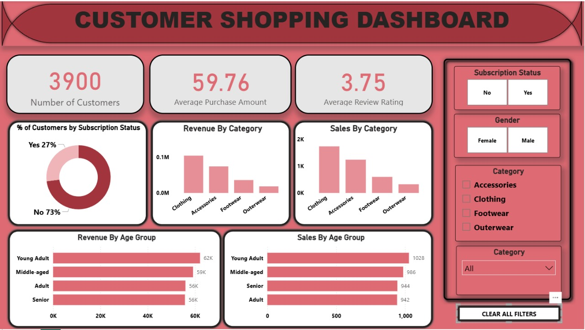

# 🛍️ Shopping Analysis of a Customer

> An end-to-end analytics workflow using **Python, SQL, and Power BI** to understand customer behavior, spending patterns, and business insights.

---

## 📘 Project Overview

This project analyzes a **retail company’s shopping dataset** to uncover insights about **customer preferences, loyalty, and purchase behavior**.  
It demonstrates how Python, SQL, and Power BI can work together to deliver actionable business intelligence for data-driven decision-making.

> 📝 Note: The dataset used is **synthetic** and designed purely for learning and demonstration purposes.

---

## 🧩 Project Workflow

| Phase | Description |
|-------|--------------|
| **1. Data Cleaning (Python)** | Preprocessed the dataset using pandas and NumPy — handled missing values, created new derived columns, and prepared data for SQL import. |
| **2. Data Analysis (SQL)** | Structured the data in PostgreSQL, performed analytical queries to extract insights about customer loyalty, discounts, and spending behavior. |
| **3. Visualization (Power BI)** | Built interactive dashboards to highlight trends in revenue, discounts, and top-performing products. |
| **4. Reporting** | Created a structured report and presentation summarizing insights and recommendations. |

---

## 🛠️ Tech Stack

| Tool | Purpose |
|------|----------|
| **Python (Jupyter Notebook)** | Data cleaning, feature engineering, and preprocessing |
| **PostgreSQL** | Data modeling and SQL-based analytics |
| **Excel** | Data validation and summary exports |
| **Power BI** | Interactive dashboard and storytelling |
| **GitHub** | Version control and portfolio showcasing |

---

## 🧱 Dataset Summary

- **Records:** ~3,900  
- **Columns:** 18  
- **Key Categories:**
  - Customer details (age, gender, location, subscription)
  - Transaction data (product, category, amount, rating)
  - Behavior metrics (discounts, shipping type, purchase frequency)
- **Missing Values:** 37 missing ratings imputed using product-category medians  
- **Source:** Synthetic dataset for academic analytics practice

---

## 🧠 Business Problems Solved

1. Identify **top-performing products and customer segments**  
2. Analyze **revenue by gender and region**  
3. Evaluate **discount effectiveness** and **loyalty impact**  
4. Compare **Express vs Standard shipping behavior**  
5. Segment customers as **New, Returning, and Loyal**  
6. Analyze **subscriber vs non-subscriber spending patterns**  
7. Study **revenue by age group** and demographics  

---

## 💻 Sample SQL Queries

```sql
-- 🧾 Total Revenue by Gender
SELECT gender, SUM(purchase_amount) AS total_revenue
FROM shopping_behavior
GROUP BY gender
ORDER BY total_revenue DESC;

-- 🛍️ Top Products by Rating
SELECT product_name, category, ROUND(AVG(review_rating), 2) AS avg_rating
FROM shopping_behavior
GROUP BY product_name, category
ORDER BY avg_rating DESC
LIMIT 5;
```

---

## 🖼️ Visual Insights
📊 Power BI Dashboard

The Power BI dashboard visualizes customer behavior and business KPIs such as:

Revenue Breakdown (by Gender, Age, and Region)
Discount Impact vs Total Spending
Customer Segmentation (Loyal, New, Returning)
Product Performance & Shipping Preferences

<p align="center">  </p>


---

## 🧾 Key Insights

Male customers generate nearly 2x higher revenue than female customers.
Subscribers contribute a larger share of total sales, showing strong loyalty potential.
Discount users spend above-average amounts — effective for conversion campaigns.
Express shipping customers tend to be high-value buyers.
Younger shoppers (18–30) are the most active demographic group.

---

## 📄 Documentation
File	Description
📊 PPT — Shopping Analysis of Customers
	Presentation summarizing analysis and findings
🧾 REPORT — Shopping Analysis of Customers
	Full project report with detailed SQL results and Power BI visuals

---

## 🧾 Conclusion

This project showcases how Python, SQL, and Power BI can be combined to transform raw retail data into meaningful insights.
It demonstrates structured problem-solving, data cleaning, analytical querying, and dashboard storytelling — essential skills for modern data analytics roles.

---

## ⚠️ Disclaimer

All customer, product, and transaction data used in this project are AI-generated and purely for educational purposes.
This project is not affiliated with any real retail company.

---

## 👨‍💻 Author

Mukesh Gopi Nandh
📧 mukeshudatha7@gmail.com

---

🌐 Connect with Me:

<p align="left"> 
  <a href="https://github.com/Mukeshgn" target="_blank"> 
     
  </a> 
  <a href="https://www.linkedin.com/in/mukesh-gopi-nandh" target="_blank"> 
     
  </a>
  <a href="https://mukeshgn.github.io/mukesh_portfolio/" target="_blank">
    
  </a>
</p>
